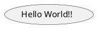
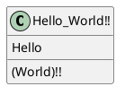
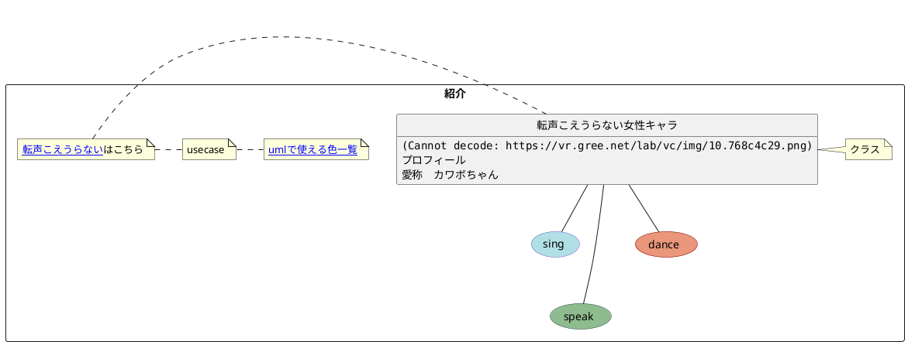

# plantUMLの勉強ログ

## メモ
imagesブランチに画像ファイルを作成、それを参照して画像を埋め込む
md中にソースの埋め込みはしない

## 拡張機能について
以下のソースコードが@startumlから始まっている場合は[こちら](https://chrome.google.com/webstore/detail/pegmatite/jegkfbnfbfnohncpcfcimepibmhlkldo)のchrome拡張機能を利用するとumlの画像が表示されるようになります。
拡張機能により画像表示されているソースコードは該当画像をダブルクリックすることで元のソースを見ることができます

## エラーや非表示
uml中で'、。,()'は使えなさそう
クラス図中で特にパーレン'()'が含まれているとメソッド扱いになる

## 注意
- 画像はモノによってはかなり重くなる、previewが使い物にならなくなるので注意（縦横のサイズが重要か？, webページだと重かったのでTwitterのアイコンから引っ張ってきた）
- 作成した画像中のテキストはコピペできるがそのままではリンクにならない
そもそも最終的には画像になるのでリンクにしても編集中しか使えない

## テクニック 
document作成時に新しく学んだ内容を以下に記述（生成画像だけでなくソースの方を見て欲しいのでソースも記述）

